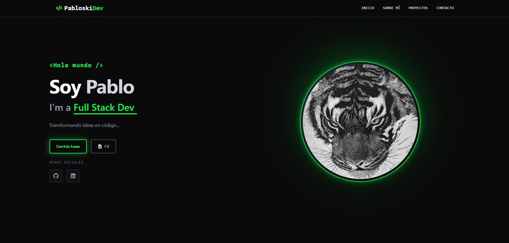

# 💻 Portafolio Full Stack MERN - Edición Cyberpunk


> Un portafolio personal interactivo con estética "Hacker/Terminal", desarrollado desde cero utilizando el stack MERN completo. Cuenta con integración de API externa (GitHub) y un sistema de mensajería propio.

---

## 🌐 Demo en Vivo

🚀 **Frontend (Vercel):** [https://portafolio-mern.vercel.app](https://portafolio-mern.vercel.app)  
🔌 **Backend API (Render):** [https://portafolio-mern-api.onrender.com](https://portafolio-mern-api.onrender.com)

---

## 📸 Captura de Pantalla



---

## ✨ Características Principales

* **🎨 Diseño UI/UX Moderno:** Estética oscura con acentos verde neón, inspirada en terminales de código. Uso de `framer-motion` para animaciones suaves.
* **🔗 Integración con GitHub API:** Los proyectos mostrados se obtienen dinámicamente desde mi cuenta de GitHub. ¡Si actualizo un repo, se actualiza el portafolio!
* **📩 Sistema de Contacto Full Stack:** Formulario funcional conectado a un Backend propio (Node/Express) que almacena los mensajes en una base de datos MongoDB en la nube.
* **📱 Totalmente Responsivo:** Adaptado para móviles, tablets y escritorio usando Tailwind CSS.
* **🔒 Seguridad:** Variables de entorno protegidas y configuración de CORS para despliegue seguro.

---

## 🛠️ Tecnologías Usadas

### Frontend (Cliente)
* **React + Vite:** Para una construcción rápida y modular.
* **Tailwind CSS:** Para el estilizado avanzado y diseño responsivo.
* **Framer Motion:** Para las transiciones y efectos de entrada.
* **React Icons:** Iconografía vectorial.

### Backend (Servidor)
* **Node.js & Express:** API RESTful para manejar las peticiones.
* **MongoDB & Mongoose:** Base de datos NoSQL para persistencia de mensajes.
* **Cors & Dotenv:** Gestión de seguridad y variables de entorno.

---

## 🚀 Instalación y Despliegue Local

Si quieres correr este proyecto en tu máquina local:

1.  **Clonar el repositorio**
    ```bash
    git clone [https://github.com/TU_USUARIO/portfolio-mern-2025.git](https://github.com/TU_USUARIO/portfolio-mern-2025.git)
    cd portfolio-mern-2025
    ```

2.  **Configurar el Backend**
    ```bash
    cd server
    npm install
    # Crea un archivo .env y agrega:
    # MONGO_URI=tu_string_de_conexion_mongodb
    # PORT=5000
    npm run dev
    ```

3.  **Configurar el Frontend**
    ```bash
    cd ../client
    npm install
    npm run dev
    ```

---

## 👨‍💻 Autor

**Pablo Torres Lell**
* Full Stack Developer en formación.
* Estudiante de Ingeniería Informática.

Hecho con ❤️ y mucho código.